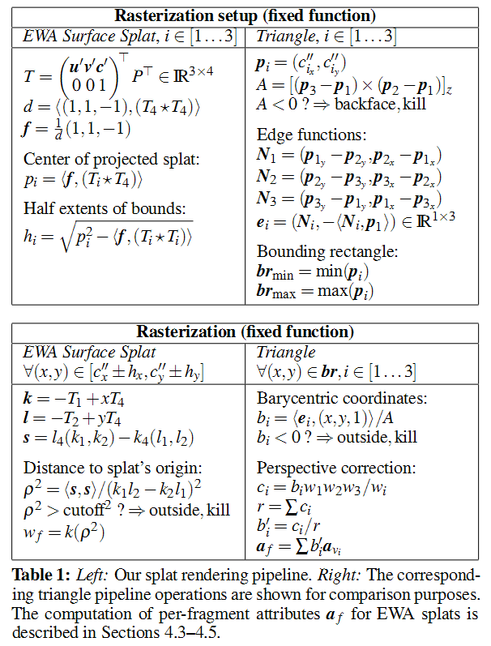
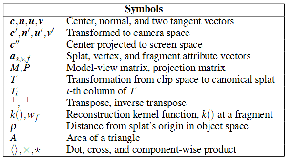

The [Surfel Rasterizer (Python)](https://colab.research.google.com/drive/1qoclD7HJ3-o0O1R8cvV3PxLhoDCMsH8W?usp=sharing) provided by the authors of the 2DGS article has been chosen as the foundation. Their implementation closely follows the methodology described in the article, which is referenced within their own publication.

[Tim Weyrich, Simon Heinzle, Timo Aila, Daniel B Fasnacht, Stephan Oetiker, Mario
Botsch, Cyril Flaig, Simon Mall, Kaspar Rohrer, Norbert Felber, et al. 2007. A
hardware architecture for surface splatting. ACM Transactions on Graphics (TOG)
26, 3 (2007), 90–es.](https://reality.cs.ucl.ac.uk/projects/pointchip/pointchip.pdf)

Below is a quote from the mentioned source:

> Table 1 shows how the ray-splat intersection is efficiently com-  
> puted. The viewing ray through the sample position (x, y) is  
> represented as an intersection of two planes (−1, 0, 0, x)> and  
> (0, −1, 0, y)> in clip space. The planes are transformed into the  
> splat’s coordinate system using the matrix T, as computed by the  
> rasterization setup. s follows by intersecting the projected planes  
> k and l with the splat plane. Due to the degeneracy of the splat’s  
> coordinate system, the computation of s and ρ2 requires very few  
> operations.






Their Python code replicates this process almost exactly.

```python
def setup_2dgs(means3D: Tensor, scales: Tensor, quats: Tensor, K: Tensor, viewmat: Tensor, cutoff: float) -> tuple[Tensor, Tensor, Tensor, Tensor]:
    # Surface splatting (2D Gaussian Splatting)

    # Rasterization setup
    projmat_H = torch.zeros(4, 4).cuda()
    projmat_H[:3, :3] = K
    projmat_H[-1, -2] = 1.0
    projmat = projmat_H.T

    rotations = build_scaling_rotation(scales, quats).permute(0, 2, 1)

    # 1. Viewing transform
    # Eq.4 and Eq.5
    p_view = (means3D @ viewmat[:3, :3]) + viewmat[-1:, :3]
    uv_view = (rotations @ viewmat[:3, :3])
    M = torch.cat([homogeneous_vec(uv_view[:, :2, :]), homogeneous(p_view.unsqueeze(1))], dim=1)
    T = M @ projmat  # T stands for (WH)^T in Eq.9

    # 2. Compute AABB
    # Homogneous plane is very useful for both ray-splat intersection and bounding box computation
    # we know how to compute u,v given x,y homogeneous plane already; computing AABB is done by a reverse process.
    # i.e compute the x, y s.t. \|hu^4\| = 1 and \|h_v^4\|=1 (distance of gaussian center to plane in the uv space)
    temp_point = torch.tensor([[cutoff ** 2, cutoff ** 2, -1.]]).cuda()

    T1 = T[..., 0]
    T2 = T[..., 1]
    T3 = T[..., 2]
    T4 = T[..., 3]

    distance = (temp_point * (T4 * T4)).sum(dim=-1).unsqueeze(1)
    f = (1 / distance) * temp_point

    point_image = torch.cat([
        (f * T1 * T4).sum(dim=-1).unsqueeze(-1),
        (f * T2 * T4).sum(dim=-1).unsqueeze(-1),
        (f * T3 * T4).sum(dim=-1).unsqueeze(-1)], dim=-1)

    half_extend = point_image * point_image - torch.cat([
        (f * T1 * T1).sum(dim=-1).unsqueeze(-1),
        (f * T2 * T2).sum(dim=-1).unsqueeze(-1),
        (f * T3 * T3).sum(dim=-1).unsqueeze(-1)], dim=-1)
    radii = half_extend.clamp(min=1e-4).sqrt()
    center = point_image

    depth = p_view[..., 2]  # depth is used only for sorting

    return T, center[..., :2], radii[..., :2], depth

```

```python
def rasterize_2dgs_ref(Ts, center, colors, opacities, depth, W, H):
    # Perform Sorting
    index = depth.sort()[1]
    Ts = Ts[index]
    center = center[index]
    colors = colors[index]
    opacities = opacities[index]

    T1 = Ts[..., 0]
    T2 = Ts[..., 1]
    T4 = Ts[..., 3]

    # Rasterization

    # 1. Generate pixels
    pix = torch.stack(torch.meshgrid(torch.arange(H),
                                     torch.arange(W), indexing='xy'), dim=-1).to('cuda')

    # 2. Compute ray splat intersection # Eq.9 and Eq.10
    x = pix.reshape(-1, 1, 2)[..., :1]
    y = pix.reshape(-1, 1, 2)[..., 1:]
    k = -T1[None] + x * T4[None]
    l = -T2[None] + y * T4[None]

    points = torch.cross(k, l, dim=-1)
    s = points[..., :2] / points[..., -1:]

    # 3. add low pass filter # Eq. 11
    # when a point (2D Gaussian) view from a far distance or from a slended angle
    # the 2D Gaussian will falls between pixels and no fragment is used to rasterize the Gaussian
    # so we should add a low pass filter to handle such aliasing.
    dist3d = (s * s).sum(dim=-1)
    filtersze = np.sqrt(2) / 2
    dist2d = (1 / filtersze) ** 2 * (torch.cat([x, y], dim=-1) - center[None]).norm(dim=-1) ** 2
    # min of dist2 is equal to max of Gaussian exp(-0.5 * dist2)
    dist2 = torch.min(dist3d, dist2d)
    # dist2 = dist3d
    depth_acc = (homogeneous(s) * T4[None]).sum(dim=-1)

    # 4. accumulate 2D gaussians through alpha blending # Eq.12
    image, depthmap = alpha_blending_with_gaussians(dist2, colors, opacities, depth_acc, H, W)

    return image, depthmap, dist2
```

или вот интеграция этого кода в 2dgs cuda_v2 rasterize_indices


```python
def raytrace_splats(pixel_coords: Tensor, means2d: Tensor, T1: Tensor, T2: Tensor, T4: Tensor) -> tuple[Tensor, Tensor]:

    # Compute ray splat intersection # Eq.9 and Eq.10
    x = pixel_coords[:, :1]
    y = pixel_coords[:, 1:]
    k = -T1 + x * T4
    l = -T2 + y * T4
    points = torch.cross(k, l, dim=-1)
    s = points[:, :2] / points[:, -1:]

    # dist3d_sq = (s * s).sum(dim=-1)
    dist3d_sq = s[:, 0] * s[:, 0] + s[:, 1] * s[:, 1]

    # add low pass filter # Eq. 11
    # when a point (2D Gaussian) view from a far distance or from a slended angle
    # the 2D Gaussian will falls between pixels and no fragment is used to rasterize the Gaussian
    # so we should add a low pass filter to handle such aliasing.

    filtersize = math.sqrt(2) / 2
    deltas = (pixel_coords - means2d)
    deltas_sq = deltas[:, 0] * deltas[:, 0] + deltas[:, 1] * deltas[:, 1]
    dist2d_sq = (1 / filtersize) ** 2 * deltas_sq

    # min of uv_dist_sq is equal to max of Gaussian exp(-0.5 * uv_dist_sq)
    uv_dist_sq = torch.min(dist3d_sq, dist2d_sq)

    #depth_accurate = (homogeneous(s) * T4).sum(dim=-1)
    depth_accurate = s[:, 0] * T4[:, 0] + s[:, 1] * T4[:, 1] + T4[:, 2] # *1

    return depth_accurate, uv_dist_sq
```

